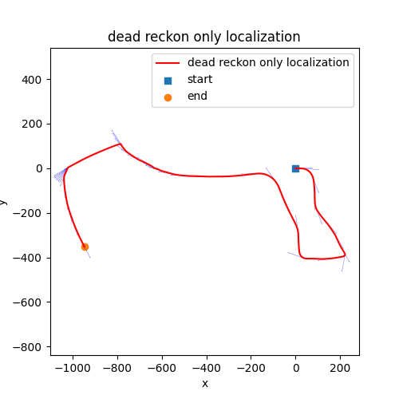
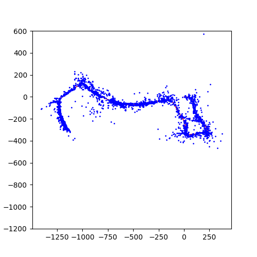

#### Visual-Inertial SLAM

For dead reckoning, use `python localization_only.py`

For the entire SLAM experiment, run `python ekf.py`

#### Main results:

+ IMU Localization via EKF Prediction

 

+ Visual-Inertial SLAM

